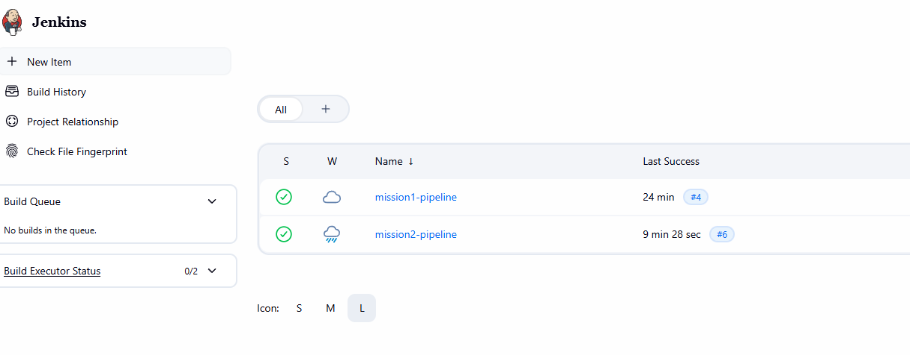
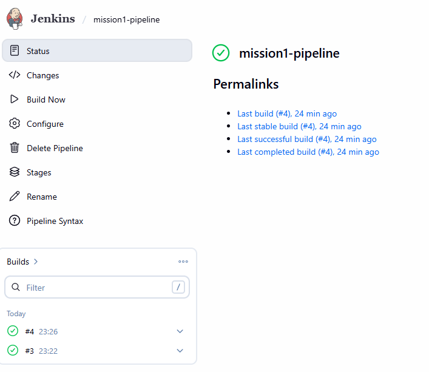
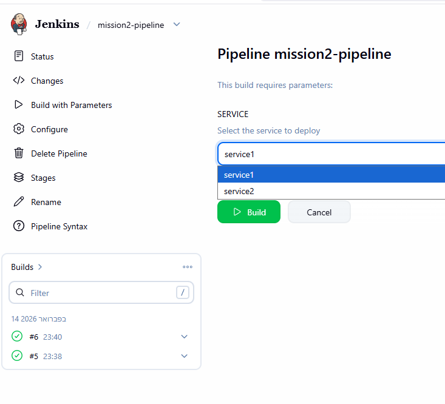
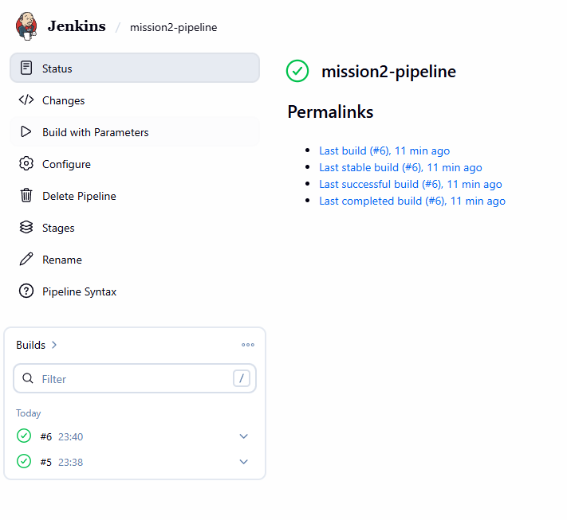
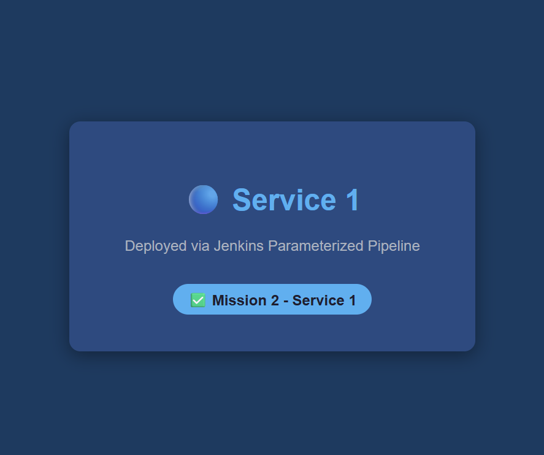
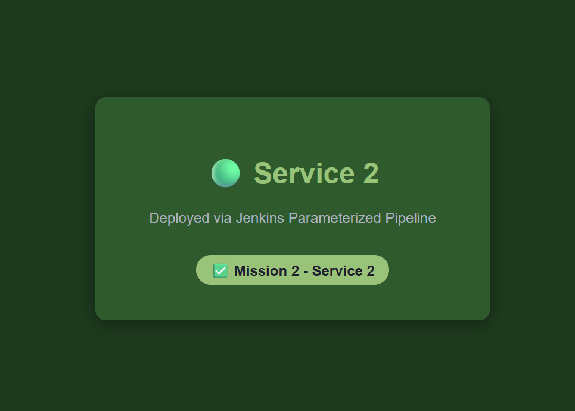
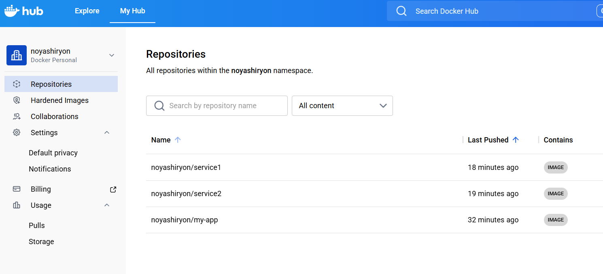

# Jenkins CI/CD Pipeline - Docker & Ansible

A DevOps project demonstrating automated CI/CD pipelines using Jenkins, Docker, DockerHub, and Ansible.

## Architecture
```
GitHub → Jenkins → Docker Build → DockerHub → Ansible → App Server
```

## Jenkins Dashboard



---

## Mission 1: Simple Deployment Pipeline

Automated pipeline that builds, tags, pushes and deploys a Dockerized application.

### Pipeline Stages
1. **Build Docker Image** - Builds image from Dockerfile
2. **Push to DockerHub** - Tags and pushes image with build number
3. **Deploy with Ansible** - Pulls and runs container on app server

### Result


---

## Mission 2: Parameterized Deployment Pipeline

User selects which service to deploy before the pipeline runs.

### Pipeline Stages
1. **Build Docker Image** - Builds image for selected service
2. **Push to DockerHub** - Pushes versioned image
3. **Deploy with Ansible** - Deploys selected service on correct port

### Parameters


### Result


### Deployed Services
| Service | Port | Screenshot |
|---------|------|------------|
| service1 | 8081 |  |
| service2 | 8082 |  |

---

## DockerHub



---

## Tech Stack
- **Jenkins** - CI/CD automation
- **Docker** - Containerization
- **DockerHub** - Image registry
- **Ansible** - Configuration management & deployment
- **AWS EC2** - Cloud infrastructure (Ubuntu 22.04)

## Infrastructure
- **jenkins-server** - Runs Jenkins, Docker, Ansible
- **app-server** - Runs deployed containers
